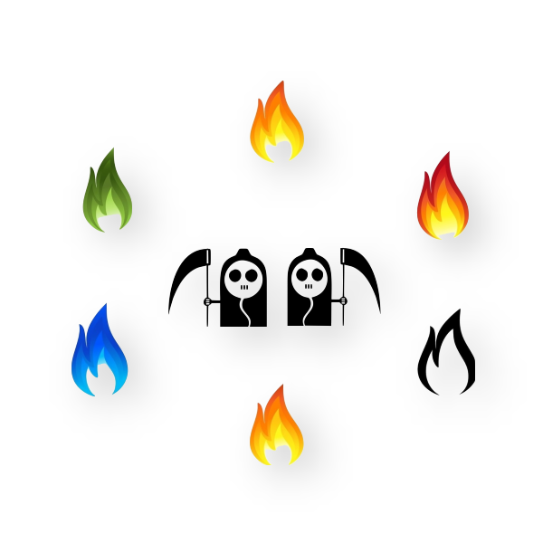

# 这里是G10小组的PRD课程仓库

#### 小组成员：郭岳  杨海波  杨寒凌   周南  李骏  叶瑶毓
#### 小组名：六男神勇斗双子星
#### 小组logo：

#### 小组logo介绍：

该logo内包含了六团火，两个devil的元素。整个布局采用了包围式，六团不同风格的火聚集在了一起将两个devil紧紧环绕，寓意六位小组成员之间的紧密配合，团结联系一起突出重围。中间的两个devil配备的两把镰刀象征着当前学期的两门课程的特点是高难度、任务紧凑密集，也暗示我们当前学期的主要矛盾是如何在“镰刀迫近”的重要关头之下不熄火苗。该Logo与小组名“六男神斗双子星”交相辉映，表面上六团火是在与两个devil进行对抗，实则是让我们时刻思考如何在两个devil的刀尖上提升自己，让火苗越烧越旺，也代表着六个小组成员“聚即是六团火，散仍是满天星”。